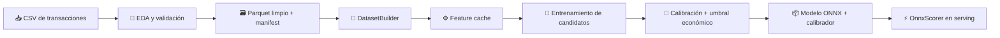

# **🛡️ FRAUD CHALLENGE 2026**

<p align="center">
  <strong>Fraud Prevention Fintech · Data Scientist Technical Challenge</strong><br>
  Una solución reproducible para detectar fraude y maximizar el resultado económico por transacción.
</p>
<p align="center">
  🧪 ETL reproducible&nbsp;&nbsp;·&nbsp;&nbsp;🤖 Machine Learning&nbsp;&nbsp;·&nbsp;&nbsp;💰 Optimización económica&nbsp;&nbsp;·&nbsp;&nbsp;⚡ ONNX serving
</p>

---

> 🎯 **En una frase:** Entrené y comaparé 10 modelos sobre 150.000 transacciones, elegí un campeón compatible con `ONNX` y fijé el umbral con datos de validación para aumentar la ganancia esperada sin contaminar el conjunto de test.

## 🏆 Resultado Final

| Indicador | Resultado |
|---|---:|
| Modelo promovido | `gradient_boosting` |
| ROC AUC · TEST | **0,8550** |
| PR AUC · TEST | **0,3761** |
| Gini · TEST | **0,7099** |
| KS · TEST | **0,5583** |
| Brier · TEST | **0,0343** |
| ECE · TEST | **0,0135** |
| Umbral operativo | **0,272647** |
| Uplift económico · VALID | **+31,9%** |
| Uplift económico · TEST | **+15,9%** |

**Configuración promovida:** feature version `v1`, hyperparameters `v2`, seed `42`.

> ✅ **Decisión:** HistGradientBoosting obtuvo el mejor PR AUC en VALID, pero se promovió Gradient Boosting por su compatibilidad con el flujo de exportación y serving en ONNX.

### 💰 Función Económica

- **+25% del monto** por cada transacción legítima aprobada.
- **−100% del monto** por cada fraude aprobado.
- El umbral se optimizó una sola vez sobre probabilidades calibradas en **VALID** y quedó congelado antes de evaluar **TEST**.
- La regla teórica sugiere aprobar cuando **p < 0,20**; el umbral empírico final fue **0,272647**.

---

## 🔄 Flujo Completo: del CSV al scoring



### 🧼 ETL y entrenamiento

1. **Ingesta y calidad:** `02_eda_fraude_ordenado.ipynb` valida el contrato, revisa nulos y duplicados, ordena temporalmente y genera el Parquet limpio, el manifest y la configuración de features.
2. **Construcción reproducible:** `DatasetBuilder` aplica contrato de tipos, deduplicación y split temporal de **7 días**: TRAIN, VALID y TEST.
3. **Feature engineering:** `FeatureCacheBuilder` crea un cache con direccionamiento por contenido. Imputadores, encoders y scalers se ajustan únicamente con TRAIN.
4. **Benchmark:** `02_orquestar_entrenamiento.ipynb` compara 10 candidatos sobre 32 features y persiste sus corridas.
5. **Promoción:** `promote_winner` calibra con Platt scaling, busca el umbral económico en VALID, exporta modelo y calibrador a ONNX, y verifica paridad.
6. **Scoring:** `OnnxScorer` recibe features crudas y devuelve probabilidad calibrada, decisión, umbral aplicado y latencia.

---

## 📊 Dataset y partición temporal

| Split | Registros | Tasa de fraude |
|---|---:|---:|
| TRAIN | 97.243 | 5,16% |
| VALID | 23.771 | 5,22% |
| TEST | 28.986 | 4,27% |
| **Total** | **150.000** | — |

**Hallazgos principales**

- ✅ 0 duplicados exactos y sin violaciones del contrato de datos.
- 🗓️ Fechas entre **2020-03-08** y **2020-04-21**.
- 🕳️ La variable `o` concentra **72,57%** de valores faltantes.
- 🔤 La variable `j` tiene **8.324 categorías**.
- 📈 `k` se comporta como variable continua en [0,1], aunque sea identificador en apariencia.
- ⚠️ `score` aporta señal predictiva; antes de producción debe confirmarse que esté disponible antes de la decisión antifraude.

### 🧠 Transformaciones de Features

| Grupo | Tratamiento |
|---|---|
| Variables categóricas de alta cardinalidad | Target encoding OOF ajustado en TRAIN |
| Variables categóricas de baja frecuencia | Agrupación de raras + one-hot encoding |
| Monto | `log1p` + robust scaling |
| Fecha | Variables temporales derivadas |
| Numéricas | Imputación y escalado dentro del pipeline |
| `score` | Incluida para el benchmark, pendiente de auditoría temporal |

---

## 🧪 Modelos Comparados

| Modelo | PR AUC · VALID | ROC AUC · VALID |
|---|---:|---:|
| HistGradientBoosting | 0,4335 | 0,8683 |
| Stacking | 0,4310 | 0,8691 |
| Gradient Boosting | 0,4286 | 0,8693 |
| FT-Transformer | 0,4284 | 0,8742 |
| DCN-V2 | 0,4282 | 0,8617 |
| MLP | 0,4191 | 0,8528 |
| CatBoost | 0,4174 | 0,8682 |
| Voting | 0,4146 | 0,8619 |
| Logistic Regression | 0,2044 | 0,7498 |
| Dummy | 0,0522 | 0,5000 |

> 🧭 **Criterio de selección:** la decisión combina calidad predictiva, calibración, impacto económico y capacidad de exportar y servir el modelo de manera reproducible.

---

## 🗂️ Estructura del Proyecto

```text
fraud_challenge_2026/
├── configs/        ⚙️ Configuraciones versionadas
├── data/           🗃️ Datos locales y derivados
├── notebooks/      📓 EDA y orquestación
├── src/
│   ├── data/       📥 Contratos y datasets
│   ├── features/   🧠 Feature engineering y cache
│   ├── models/     🤖 Modelos y calibración
│   ├── training/   🏋️ Entrenamiento
│   ├── evaluation/ 📏 Métricas y economía
│   ├── promotion/  🏆 Promoción del campeón
│   └── serving/    ⚡ Scoring ONNX
├── tests/          ✅ Pruebas automatizadas
├── artifacts/      📦 Runs, modelos y reportes
└── scripts/        🛠️ Generación de reportes
```

---

## 🚀 Reproducir la Solución

```bash
cd fraud_challenge_2026
poetry install
poetry run python -m pytest
poetry run fraud-promote-winner \
  --runs-dir artifacts/runs \
  --config configs/promotion/v1.yml
```

El CSV se espera en:

```text
$FRAUD_DATA_ROOT/raw/fraud_dataset_2026_.csv
```

Si la variable no está definida, el proyecto usa por defecto el directorio local `data/`.

<p align="center">
  <strong>🛡️ Detectar mejor. Decidir con contexto económico. Servir de forma reproducible.</strong>
</p>